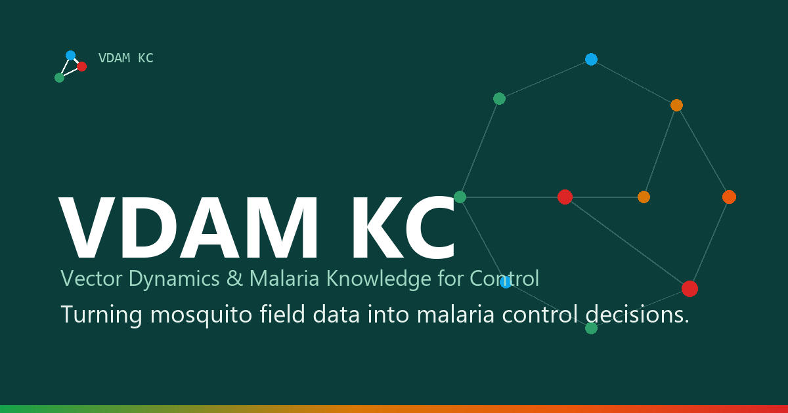

<p align="center">
  
</p>

<h1 align="center">Vector Sentinel Engine</h1>

<p align="center">
  <strong>Turning mosquito field data into malaria-control decisions.</strong><br>
  A field-to-decision surveillance platform for malaria vectors — data capture, AI-assisted
  specimen screening, insecticide-resistance tracking, forecasting, and policy-ready reporting.
</p>

<p align="center">
  <a href="https://vdamkc.netlify.app"></a>
  
  
  
</p>

---

> ### ⚠️ Screening aid — not a validated diagnostic device
> Vector Sentinel Engine is a **decision-support and screening tool**. Its AI and morphological-key
> modules assist trained personnel; they do **not** replace laboratory confirmation. Several modules
> deliberately refuse to claim more precision than the underlying data supports — cryptic species
> complexes (e.g. *An. gambiae* complex, *An. funestus* group) are **never** resolved to a single
> species by image or key alone. **Only PCR can split them.** Do not use any output here as a
> standalone clinical or entomological diagnosis.

---

## What it is

Vector Sentinel Engine is a single-page web app built by **VDAM KC** (Vector Dynamics & Malaria
Knowledge for Control) for malaria vector surveillance in endemic regions. It is designed for the
conditions the field actually faces — patchy connectivity, multiple vector species, and rising
insecticide resistance — and structured so the national programmes and field teams who use it can
eventually own and run it themselves.

It brings the full surveillance loop into one place:

- **Field data capture** — trap counts, larval-habitat surveys, and WHO-standard bioassays, logged
  from a phone or tablet.
- **AI-assisted specimen screening** — image- and morphological-key–based identification as a
  *screening aid*, with taxonomic guardrails that never over-resolve cryptic complexes.
- **Resistance & risk tracking** — *Anopheles* species composition and insecticide-resistance
  trends, combined with rainfall and clinical case data into rolling district-level risk scores.
- **Forecasting & reporting** — seasonal forecasts and exports structured around the formats
  national malaria programmes already use for WHO reporting cycles.

## Features

| Module | What it does |
| --- | --- |
| **Command Center** | Live dashboard of surveillance status, catches, and site activity. |
| **Site Log Entry** | Offline-friendly field logging of trap/larval counts by genus. |
| **AI Diagnostics** | Specimen screening via AI vision, deterministic morphological keys, and an optional trained CNN classifier — all respecting the cryptic-complex ceiling. |
| **PCR Lab** | Molecular confirmation workflow that splits complexes to species and scores identification accuracy. |
| **Bioassay Entry** | WHO-threshold insecticide-resistance bioassay tracking. |
| **Clinical Case Entry** | Clinical malaria case data for entomological–epidemiological correlation. |
| **Change Trends / Correlations** | Vector, environmental, and case trends over time. |
| **Seasonal Forecast / Risk Engine** | Forecasts and district-level hotspot risk scoring. |
| **AI Copilot** | Natural-language advisory over the surveillance data. |
| **Reports** | Policy-ready, export-ready summaries. |

## Screenshots

<!--
  Drop PNG captures into docs/screenshots/ and uncomment the block below.
  Suggested set: the Command Center, AI Diagnostics (a complex-level result with the
  "PCR required" badge), the Risk Engine map, and a generated Report.
-->

<!--
| Command Center | AI Diagnostics |
| --- | --- |
|  |  |

| Risk Engine | Reports |
| --- | --- |
|  |  |
-->

> _In-app screenshots coming soon._ In the meantime, see the project site: **[vdamkc.netlify.app](https://vdamkc.netlify.app)**.

## Live app

- **Project site & demo requests:** **[vdamkc.netlify.app](https://vdamkc.netlify.app)**
- The app is provisioned per deployment (it needs a Supabase backend and API keys — see below).
  To run it locally, follow **Setup**.

## Setup

**Requirements:** Python 3.12.

```bash
# 1. Clone
git clone https://github.com/raphaelnjapdze-prog/VECTOR_SENTINEL_PROJECT.git
cd VECTOR_SENTINEL_PROJECT

# 2. Install the core runtime
pip install -r requirements.txt

# 3. Run
streamlit run app.py
```

Dependencies are pinned across three files:

| File | Purpose |
| --- | --- |
| `requirements.txt` | Core runtime for the Streamlit app. |
| `requirements-ml.txt` | Optional heavy ML extras (`torch`, `torchvision`, `opencv`) for the trained classifier and retraining workflow. Lazy-imported — the app runs fine without them. |
| `requirements-dev.txt` | Dev/CI tooling (`pytest`, `ruff`); also installs core. |

### Configuration & secrets

Secrets are read from `.streamlit/secrets.toml` first, then environment variables / a `.env` file.

| Key | Purpose |
| --- | --- |
| `GEMINI_API_KEY` | Google Gemini — vision inference and the AI Copilot. |
| `SUPABASE_URL`, `SUPABASE_ANON_KEY` | Required for any data persistence. |
| `SUPABASE_SERVICE_ROLE_KEY` | Optional — enables table-creation helpers. |

> **Honest degradation is a hard design rule.** If Supabase isn't configured, data functions return
> empty/"not connected" states — the app **never** substitutes fabricated data for a missing backend.

### Database migrations

The files in `sql/` are applied by hand in the Supabase SQL Editor. All are additive and safe
to re-run.

| File | Purpose |
| --- | --- |
| `create_specimen_records.sql` | The central table behind every page. |
| `create_bioassay_results.sql` | WHO tube bioassay replicates. |
| `create_clinical_case_data.sql` | Confirmed malaria case counts per facility. |
| `add_specimen_subsampling.sql` | Vialing individuals out of a batch. |
| `add_investigator_profiles.sql` | Profiles + the avatar bucket. |
| `enforce_collector_id.sql` | Rejects blank collectors at the database. |
| `add_update_policies.sql`, `add_delete_policies.sql` | The RLS policies the app's writes need. |
| `add_storage_policies.sql` | The `specimen-photos` bucket: upload requires a signed-in user, read is public. |
| `add_lga_column.sql` | Records which LGA a collection happened in — the DHIS2 org unit dimension. |
| `verify_deletion.sql` | Read-only/rolled-back check that the policies actually work. |

Run the two policy files on any existing database — without them, updates and deletes match
zero rows *without raising*, so they silently do nothing. Then run `verify_deletion.sql`,
which exercises them as the `authenticated` role and rolls everything back.

`add_storage_policies.sql` covers a separate surface: photos live in a Storage bucket, not in
a table, so table policies say nothing about them. Unlike a table write, a rejected upload
*does* raise — a failed photo upload surfaces as "new row violates row-level security policy".
Its pre-flight query prints the bucket's current policies before changing anything.

> The *Provision Remote Tables* button on Profile → Security does not work and cannot replace
> this: it needs `SUPABASE_SERVICE_ROLE_KEY` plus a `public.sql(sql text)` function that does
> not exist in the database. Apply migrations by hand in the SQL Editor.

The two side-table schemas are **reconstructions**: those tables were created by hand in the
dashboard before the files existed, so the live tables are the authority. Each file ends with
a query that prints the live column list to diff against it, and each keeps its `CHECK`
constraints in a clearly marked section, since adding one to a table with violating rows
fails outright.

### Clearing trial data

Deleting entries between trial runs is documented in
**[docs/DELETING_ENTRIES.md](docs/DELETING_ENTRIES.md)** — per-entry deletion from the Site
Log, the bulk reset in Profile → Danger Zone, and what travels with a deleted specimen
(its photos, its vialed-out individuals, and its batch's tally).

## Development

```bash
pip install -r requirements-dev.txt

pytest              # unit tests (tests/)
ruff check .        # lint
ruff check . --fix  # auto-fix
```

CI (GitHub Actions) runs `ruff` + `pytest` on every push/PR against Python 3.12.

Architecture, the SPA routing model, the Supabase data model, and the taxonomy guardrails are
documented in detail in **[CLAUDE.md](CLAUDE.md)**.

## About VDAM KC

**VDAM KC** — Vector Dynamics & Malaria Knowledge for Control — is an independent vector-surveillance
and analytics practice building tools that turn entomological field data into malaria-control
decisions, designed to be handed over to and run by local teams and ministries.

**Raphael Njapdze Kawep** — Founder, Medical Entomologist & Data Engineer.
Built at the University of Maiduguri (UNIMAID).

## License

© VDAM KC. All rights reserved. Contact via **[vdamkc.netlify.app](https://vdamkc.netlify.app)** for
use, deployment, or collaboration.
